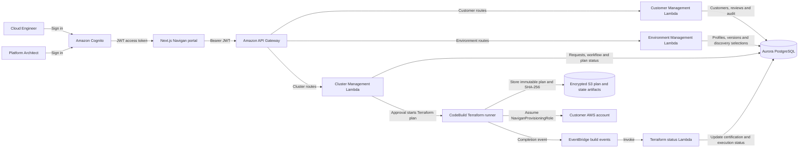
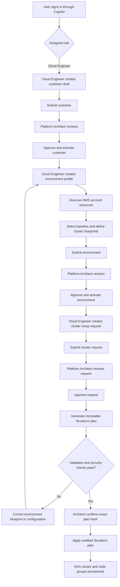

# Navigan Application Flow

## End-to-end architecture

## Governed business workflow

## Primary API groups

| API group | Main responsibility |
|---|---|
| `/api/v1/customers` | Customer onboarding, review, approval, activation and audit |
| `/api/v1/environments` | Cloud discovery, reusable environment profiles, versioning and activation |
| `/api/v1/clusters` | Cluster setup requests, architecture review, Terraform planning and apply |

